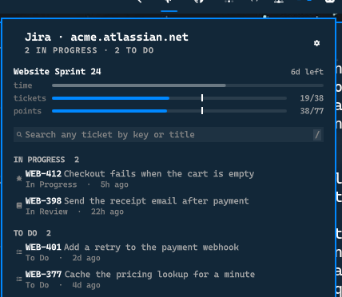

# Omarchy Jira

Your Jira work in the Omarchy bar, and a search box for everything else.



## What it shows

- **Your tickets**, split into what is in progress and what is still to do
- **The active sprint**, with progress bars for time, tickets and story points
- **Search across the whole site**, by issue key, by part of a key, or by title

It is not a Jira client. It answers two questions: what is on my plate right
now, and where is ticket X.

## Requirements

Omarchy Quattro with shell plugin support. Everything it needs at runtime,
`curl`, `jq` and `secret-tool`, is already part of an Omarchy install.

## Install

```bash
omarchy plugin add https://github.com/tmn73/omarchy-jira.git --enable
cd ~/.config/omarchy/plugins/tmn73.jira && ./omarchy-jira-auth
```

The setup asks for your site, your account email, and an API token, verifies
them against Jira before storing anything, and prints the scopes to tick while
you are on the token page.

### Update

```bash
omarchy plugin update tmn73.jira
```

### Remove

```bash
omarchy plugin remove tmn73.jira
```

Removing the plugin leaves the credential in your keyring. To take that with it:

```bash
./omarchy-jira-auth --clear
```

## Credentials

The token lives in your system keyring, under `service=omarchy-jira`. The plugin
reads it at request time and never copies, logs, caches, or writes it anywhere.
Nothing lands in `shell.json` or in a dotfile, and no credential is ever typed
into a bar popup.

A few details are deliberate rather than incidental:

- Credentials reach `curl` through a config file on a pipe, never as an
  argument, because anything in `argv` is readable by every process on the
  machine through `ps`.
- The same goes for your search text and for what Jira sends back: the query
  reaches the helper through the environment, which only you can read,
  request bodies reach `curl` on stdin, and sprint names and goals reach `jq`
  through the environment.
- Ticket summaries, statuses and sprint names are shown as plain text, so
  markup written into a Jira ticket is never rendered and cannot make your
  desktop load anything.
- The plugin never calls `secret-tool search`, which prints the secret on
  stdout. It reads the credential with `lookup`, which returns only what was
  asked for.

### Token scopes

```
read:jira-work                  your tickets and the search
read:jira-user                  validating the token during setup
```

Sprints are read from the board when the token also carries the Jira Software
app:

```
read:board-scope:jira-software
read:sprint:jira-software
read:issue-details:jira
read:jql:jira
```

Without those four the sprint is derived from the tickets in it instead, which
works but cannot see a sprint that holds no ticket yet. The settings pane tells
you which of the two is in use.

## Controls

| Input | Action |
| --- | --- |
| Left click the icon | Open or close the panel |
| Right click the icon | Refresh |
| Click a row | Open the ticket in your browser |
| `j` / `k` / arrows | Move through rows |
| `Enter` | Open the highlighted ticket |
| `y` | Copy the highlighted issue key |
| `/` | Focus search |
| `r` | Refresh |
| `,` | Open the settings page |
| `Escape` | Clear the search, then close the panel |

## Search

Typing filters the tickets already loaded straight away, and a query goes out to
Jira after a short pause. Both sets of results land in one list.

Search goes through Jira's own issue picker, so a bare number finds the ticket
it belongs to:

```
1069      finds DS-1069, and DES-1069 if you follow that project too
DS-1069   finds it directly
supplier  finds tickets with that word in the title
```

## Settings

Interval and row count are ordinary widget settings, editable wherever Omarchy
shows plugin settings.

Everything that depends on your Jira lives in the panel's own settings page,
reachable with the gear or with `,`:

- **Projects.** Untick the ones you do not care about. Ticked projects feed your
  lists and bound your searches.
- **Sprint bars.** Time, tickets and story points, independently. Untick them
  all to turn the section off, which also stops the plugin asking Jira for it.
  The story points row tells you how much of the sprint is actually estimated,
  because counting points is misleading when most tickets carry none.
- **What counts as done.** The statuses in your sprint, with the ones Jira calls
  finished ticked to start with. If your team treats `Ready to Merge` as
  finished, tick it and the bars agree with your board.

## How it reads a sprint

The bars share one axis so they can be compared, and each work bar carries a
mark where the clock stands: past the mark is ahead of schedule, short of it is
behind. That comparison is shown with a mark rather than a colour, because
themes are free to define their accent and their alert colour as the same hue,
and several do.

## Local development

```bash
omarchy plugin validate .
tests/auth-test.sh && tests/helper-test.sh && tests/qml-source-test.sh
node --test tests/model.test.js
```

Run the helpers directly to see what the panel is given:

```bash
./omarchy-jira-fetch --projects DS --sprint | jq
OMARCHY_JIRA_QUERY=1069 ./omarchy-jira-fetch --search | jq
```

QML changes need `omarchy-restart-shell`. Touching a file is not enough: the
shell keeps the compiled version in memory, so edits appear to do nothing and
error messages keep describing the previous version.

## How it works

`Service.qml` schedules `omarchy-jira-fetch`, which owns every API call and
every credential access and prints one JSON document. `Panel.qml` assembles
small components and owns keyboard focus. `Model.js` holds the logic worth
testing and is exercised under `node --test` without a running shell.

One rule shapes the whole plugin: nothing keys off a status name. Every Jira
site names its statuses freely, so `In Review` is a label, never a signal. The
portable signal is the status category, and where categories are not enough, the
answer is a setting rather than a guess.

## License

MIT
